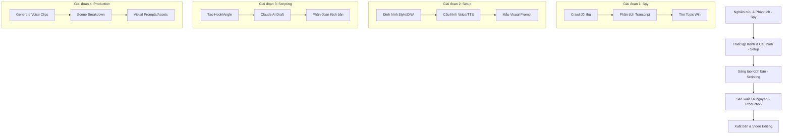

# Project Workflow Overview 🚀

Tài liệu này mô tả quy trình làm việc toàn diện trong **Faceless Studio**, từ bước nghiên cứu đối thủ cho đến khi có được kịch bản và tài nguyên hoàn chỉnh để sản xuất video.

## 🔄 Toàn cảnh Workflow

Quy trình sản xuất được chia thành 4 giai đoạn chính:

---

## 📋 Chi tiết từng bước

### 1. 🕵️ Giai đoạn 1: Nghiên cứu (Spy Module)
Mục tiêu là tìm ra những gì đang hoạt động hiệu quả trên thị trường.
- **Crawl & Monitor:** Theo dõi các kênh YouTube/TikTok hàng đầu trong ngách (niche).
- **Phân tích dữ liệu:** Tự động lấy Transcript, chụp các frame quan trọng để hiểu cách họ giữ chân người xem.
- **Xác định Topic:** Lọc ra các video có hiệu suất cao nhất để làm nguyên liệu cho kịch bản mới.

### 2. ⚙️ Giai đoạn 2: Thiết lập (Channel Configuration)
Mỗi kênh sẽ có một "bản sắc" riêng.
- **Channel DNA:** Định nghĩa ngôn ngữ, phong cách kể chuyện, đối tượng mục tiêu.
- **Voice Setup:** Chọn giọng đọc từ ElevenLabs, tinh chỉnh độ ổn định (stability) và tốc độ (speed).
- **Visual Style:** Thiết lập các prompt mẫu cho AI Image Generator để đảm bảo tính nhất quán về hình ảnh.

### 3. ✍️ Giai đoạn 3: Biên kịch (Scripting Module)
Sử dụng sức mạnh của AI để tạo nội dung chất lượng cao.
- **Cấu trúc Hook-Angle-Pillar:** Đảm bảo kịch bản có mở đầu hấp dẫn và nội dung giá trị.
- **AI Collaboration:** Sử dụng Claude AI để viết nháp và chỉnh sửa kịch bản theo yêu cầu cụ thể.
- **Phân đoạn:** Chia kịch bản thành các phần nhỏ (intro, body, outro) để dễ dàng quản lý.

### 4. 🎬 Giai đoạn 4: Sản xuất tài nguyên (Production Module)
Chuẩn bị các thành phần rời rạc trước khi ghép thành video.
- **Voiceover Generation:** Chuyển đổi kịch bản thành các file âm thanh (.mp3) chất lượng cao.
- **Scene Breakdown:** Tự động chia kịch bản thành các phân cảnh (scenes). Mỗi cảnh sẽ đính kèm lời đọc (VO) và mô tả hình ảnh.
- **Visual Prompting:** Tạo ra các câu lệnh (prompts) chi tiết cho từng cảnh để generate hình ảnh/video bằng các công cụ như Midjourney, Stable Diffusion, hoặc Runway.

---

## 🛠️ Công cụ hỗ trợ trong Workflow

- **Database (SQLite):** Lưu trữ toàn bộ lịch sử nghiên cứu, kịch bản và cấu hình.
- **Filesystem Storage:** Lưu trữ voice clips và các file export tại `~/.faceless-studio/`.
- **Import/Export:** Cho phép sao lưu và di chuyển dữ liệu giữa các máy tính hoặc chia sẻ cấu hình kênh.

---

## 🏁 Kết quả đầu ra (Output)

Kết thúc workflow, bạn sẽ nhận được:
1. Danh sách các file Voiceover (.mp3) theo từng cảnh.
2. Bản mô tả phân cảnh chi tiết (Scene Sheet).
3. Danh sách Visual Prompts tối ưu cho từng cảnh.
4. Dữ liệu cấu trúc để import vào các công cụ edit video tự động (nếu có).
